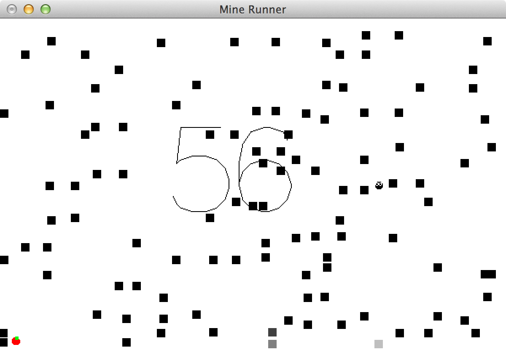

Mine Runner
==========

A simple game in Haskell and Gloss

# Playing
You control a little black creature that roams in a white world where the ends are mysteriously connected.
Every time you press the arrow keys it changes direction, naively following your commands.

The little creature is hungry and a giant number in the center, painted on to the ground in a strange aliased way, increases every time the critter eats an apple.
You seem to get 1 point every time it eats a red apple and 3 for the green ones.
The latter must be more delicious.

After chasing a few apples you notice something strange.
The little bugger seems to be leaving squares behind it.
They start out light, but get darker, when?
After observing it for a bit you conclude, that it happens when you turn.
The existing squares get darker and new ones are left behind by the hungry fellow.

It can go through them when they're light, but after a couple of turns they get too dark to pass and you lose your points when hitting them. Damn.
You better avoid turning too much then.

Now you notice something new.
Every time the creature eats an apple you get points, but it also seems to move faster!
This makes getting more points harder.
What a challenging world this black thing is trapped in.
It's a good thing you're here to guide it.

# Language
I developed this little game to learn Haskell and found the experience both enlightening and pleasing.
Gloss is an excellent library and a joy to work with.

# Binaries
TODO: Coming...

# License
The code is licensed under the MIT license.

Copyright (c) 2013 Andreas H. From

Permission is hereby granted, free of charge, to any person obtaining a copy
of this software and associated documentation files (the "Software"), to deal
in the Software without restriction, including without limitation the rights
to use, copy, modify, merge, publish, distribute, sublicense, and/or sell
copies of the Software, and to permit persons to whom the Software is
furnished to do so, subject to the following conditions:

The above copyright notice and this permission notice shall be included in all
copies or substantial portions of the Software.

THE SOFTWARE IS PROVIDED "AS IS", WITHOUT WARRANTY OF ANY KIND, EXPRESS OR
IMPLIED, INCLUDING BUT NOT LIMITED TO THE WARRANTIES OF MERCHANTABILITY,
FITNESS FOR A PARTICULAR PURPOSE AND NONINFRINGEMENT. IN NO EVENT SHALL THE
AUTHORS OR COPYRIGHT HOLDERS BE LIABLE FOR ANY CLAIM, DAMAGES OR OTHER
LIABILITY, WHETHER IN AN ACTION OF CONTRACT, TORT OR OTHERWISE, ARISING FROM,
OUT OF OR IN CONNECTION WITH THE SOFTWARE OR THE USE OR OTHER DEALINGS IN THE
SOFTWARE.
